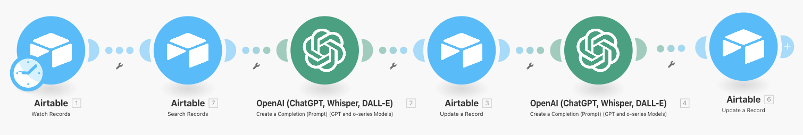

# 🏛️ AI Curator – System Architecture

## Overview

The AI Curator is an automation system designed to help art buyers discover artworks. It combines **Airtable** as a database with **OpenAI GPT** for AI-powered conversations.

## 🔗 Workflow Overview

1. **Buyer sends inquiry via Airtable form or manual entry.**
2. The system queries the artwork database for available items.
3. OpenAI generates a curated reply that includes:
   - A description of available artworks (with looping template logic)
   - Status handling (Available, By Request, or Sold)
   - A polite request for the buyer's WhatsApp number
4. WhatsApp number parsing runs separately as a dedicated extraction task.
5. Status is manually interpreted from context based on whether the buyer replies with a WhatsApp number or requests to proceed.

## ⚙️ How Status Is Handled

- The **status logic is embedded directly in the AI reply prompt.**  
The AI dynamically phrases responses depending on whether an artwork is:
- `Available`
- `By Request`
- `Sold`

Status phrases are **written in natural language for the buyer**, but there is no separate status classifier.

## 📦 Tech Stack

- **Airtable** – Database of artworks and buyer messages
- **OpenAI GPT-3.5 / GPT-4** – Reply generation and WhatsApp number parsing
- **Make (Integromat)** – No-code automation platform (deprecated)
- **GitHub** – Project documentation and versioned backup

## 🗺️ Diagram

---
